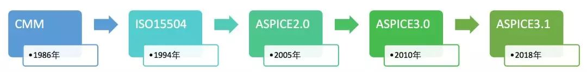

# Favorites

该仓库由于一些开源项目学习、汇总。

## Introduction

项目收集、学习、汇总。

## Projects

### lOT

物联网

***EMQ X***: 简称EMQ，是一款完全开源，高度可伸缩，高可用的分布式MQTT消息服务器，同时也支持CoAP/LwM2M一站式lOT协议接入。EMQ 是 5G 时代万物互联的消息引擎，适用于 IoT、M2M 和移动应用程序，可处理千万级别的并发客户端，[***详见***](lOT/emqx/README.md)。

## Process

开发流程相关

### A-Spice

[***ASPICE***](process/ASPICE/README.md): 全称是"Automotive Software Process Improvement and Capacity Determination"，汽车软件过程改进及能力评定，是汽车行业用于评价软件开发团队的研发能力水平的模型框架。最初由欧洲20多家主要汽车制造商共同制定，于2005年发布，目的是为了指导汽车零部件研发厂商的软件开发流程，从而改善车载软件的质量。

多年以来，ASPICE在欧洲汽车行业内被广泛用于研发流程改善及供应商的研发能力评价。随着近年车联网、智能驾驶、新能源汽车的迅速发展，软件在汽车研发中的占比激增，企业对软件质量管理的需求不断增强，ASPICE逐渐被引入到国内，被国内的企业所熟知。另一方面随着TS16949的改版，对企业提出定期审核的要求，也对ASPICE在国内的应用起到的极大的促进作用。



> ***Note:***
ubuntu 提速 github，通过修改hosts。
获取*ip*地址，写入hosts文件，刷新缓存，命令如下：
>
```
nslookup github.com                     /* 获取Github的IP地址 */
nslookup github.global.ssl.fastly.net   /* 获取github.global.ssl.fastly.net的IP地址 */
nslookup assets-cdn.github.com
sudo vim /etc/hosts                     /* 写入hosts */
sudo /etc/init.d/networking restart     /* 刷新缓存 */
```
