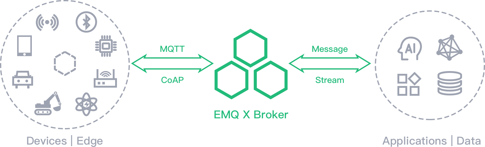

# EMQ X



*EMQ X* 是一款完全开源，高度可伸缩，高可用的分布式 MQTT 消息服务器，适用于 IoT、M2M 和移动应用程序，可处理千万级别的并发客户端。

从 3.0 版本开始，*EMQ X* 完整支持 MQTT V5.0 协议规范，向下兼容 MQTT V3.1 和 V3.1.1，并支持 MQTT-SN、CoAP、LwM2M、WebSocket 和 STOMP 等通信协议。*EMQ X 3.0* 单集群可支持千万级别的 MQTT 并发连接。

- 新功能的完整列表，请参阅[EMQ X Release Notes](https://github.com/emqx/emqx/releases)。
- 获取更多信息，请访问[EMQ X 官网](https://www.emqx.cn/)。

## 安装

*EMQ X* 是跨平台的，支持 Linux、Unix、macOS 以及 Windows。这意味着 *EMQ X* 可以部署在 x86_64 架构的服务器上，也可以部署在 Raspberry Pi 这样的 ARM 设备上。

#### EMQ X Docker 镜像安装

```
docker run -d --name emqx -p 1883:1883 -p 8083:8083 -p 8883:8883 -p 8084:8084 -p 18083:18083 emqx/emqx
```

## 从源码构建

**获取代码**: EMQ X源代码可访问[EMQ X GitHub](https://github.com/emqx/emqx)。

```
git clone https://github.com/emqx/emqx-rel.git
```

## Version history

- 2020年7月23日，v4.1.2 发布支持多语言扩展并提供 SDK，已支持语言：Python, Java
- 2020年1月10日， v4.0.0 发布, 我们通过重构 channel 和 session 显著地改进了吞吐性能，通过添加更多的钩子和统计指标增强了可扩展性，重新设计了规则引擎的 SQL，并优化 Edge 版本的性能表现。
- 2019年11月18日，v4.0-beta.4 发布，主要为功能改进及 Bug 修复。
- 2019年4月26日，v3.1.0 发布，规则引擎可正式用于生产环境，以及部分插件优化。
- 2018年9月24日，v3.0.0 (Promise of Tomorrow) 发布，重新设计 ETS 表、以及优化性能。
- 2017年11月22日，v2.3.0 发布，改进了发布订阅设计，优化了消息路由效率。
- 2016年11月25日，v2.0 (West of West Lake) 发布，支持本地订阅、共享订阅，新增 CoAP 及MQTT-SN 协议接入，支持更多的操作系统。
- 2016年6月2日，v1.1 发布，支持 HTTP 认证、完善多个数据库插件。
- 2016年4月14日，v1.0 (The Seven Mile Journey) 发布。该版本完整支持MQTT v3.1/v3.1.1 协议，单节点支持百万级并发。
- 2015年9月28日，v0.11.0 发布，新增Stomp以及SockJS插件。
- 2015年1月28日，v0.3.0 发布，支持 QoS0, QoS1 以及 QoS2 的发布与订阅。
- 2012年12月22日，EMQ 第一个版本 v0.1.0 发布。