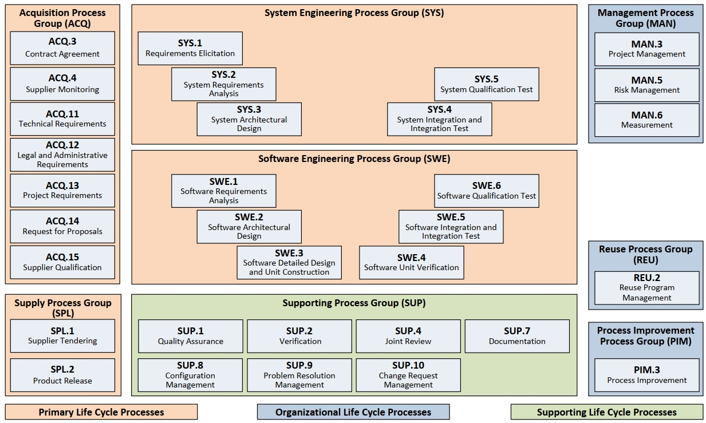
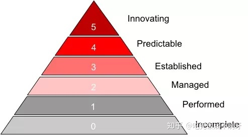

# ASPICE

### ASPICE 能力等级

ASPICE根据企业管理的细致和严谨程度不同，将企业的软件研发能力划分为6个级别，0级为最低级，5级为最高级。级别越高代表研发项目出现意外情况的可能性更低，企业对项目和产品的成功掌控力越强，越有能力按时向客户交付高质量的产品。

- *0级*，Incomplete (不完全)，代表一种混乱的状态。
- *1级*，Performed (已执行)，代表企业已经能够完成产品研发相关的工作，但缺乏管理，虽然偶尔能够成功，但项目中存在大量不确定的因素，对项目缺乏掌控能力，无法确保一定能够按时交付高质量的产品。
- *2级*，Managed (已管理)，代表企业不仅能够完成产品研发相关工作还能有提前制定严谨和周全的工作计划，并能有效根据计划实施项目监控和管理，各项目能够有序进行。
- *3级*，Established (已建立)，代表不仅各项目能够管理得很好，而且能够有效的从历史项目中积累经验和教训，形成公司的知识资产和标准工作流程，用于对今后项目的参考和指导以及公司管理的持续改善。
- *4级*，Predictable (可预测)，引入统计学知识和技术，对项目相关各项数据进行统计和分析，并将之运用于未来的项目管理之中，达到对项目结果的预测，并根据预测结果对项目进行实时的调整，确保达成项目目标。
- *5级*，Innovating (最佳化)，代表企业能够基于商业目标的需要，主动的对过程进行调整，对变革管理有很强的管理能力，能够基于对过程的量化分析设定明确有效的过程改进目标，并能对过程改进结果进行有效的量化监控和分析。